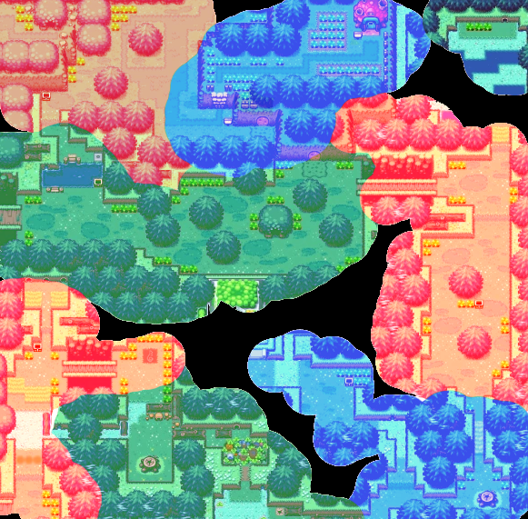
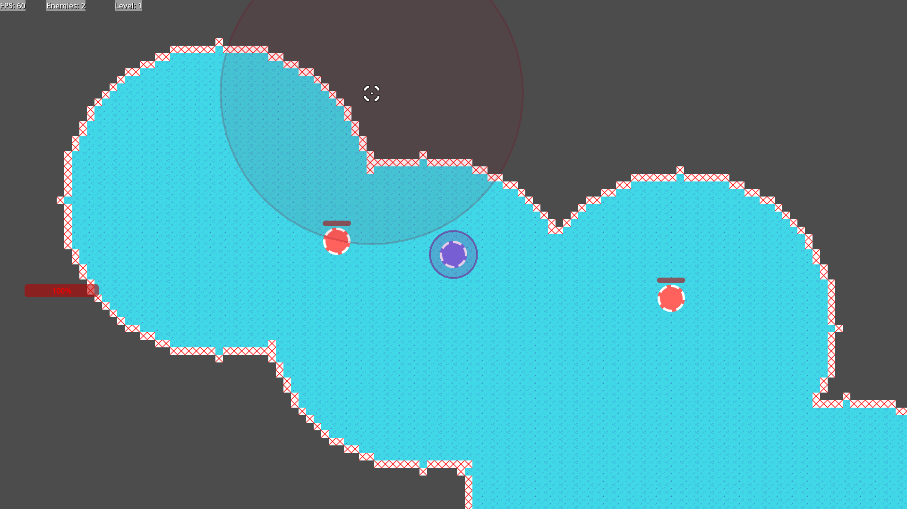

After a long time without making a game i had to calm the itch and start a new project!

This time i have decided to go with a bullet heaven, i didn't even know that was the name of the genre until i looked it up, i just had played holocure a few times and really enjoyed the flow of the game. Since then as research for this game i have played brotato and vampire survivors.

Most of these games have an infinite field in which enemies spawn, i wanted to give this a bit of a twist, so instead of just navigating an infinite field... you have to paint it!

This very early concept art using a TloZ map was from when i was thinking of revealing full structures hidden on the map... but i think i wil stick with more plain maps in order to facilitate navigation. It also shows the posibility of having different colors of inks with different effects each, this is something i'm still evaluating but haven't though much about yet.

Anyways, here is a real screenshot of the current state of the game

Everything is still very early on in development, and my limited artistic abilities don't help much either hahaha, but you can already see some of the main ideas at play, the player has to both control the main character (blue chip) and avoid being hit by the enemies (red chips) while using the mouse to draw new terrain.

I have already layed the foundations for drawing new terrain, distance, meele and area attacks, and enemies that follow you.